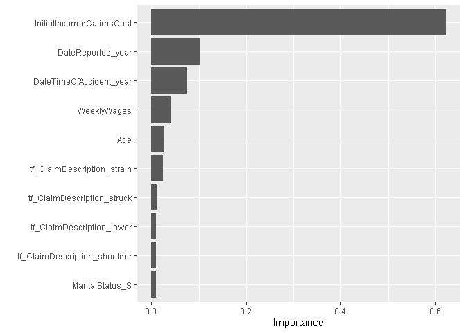

R Notebook
================

# Competition: Actuarial loss prediction

## Preliminares

### Cargar Paquetes

``` r
library(tidyverse)
library(tidymodels)
library(skimr)
library(textrecipes)
library(parallel)
library(doParallel)
library(glmnet)
library(xgboost)
library(vip)
```

### Obtener los datos

Importar

``` r
datos= readr::read_csv('Data/train.csv')
```

    ## Rows: 54000 Columns: 15
    ## -- Column specification --------------------------------------------------------
    ## Delimiter: ","
    ## chr  (5): ClaimNumber, Gender, MaritalStatus, PartTimeFullTime, ClaimDescrip...
    ## dbl  (8): Age, DependentChildren, DependentsOther, WeeklyWages, HoursWorkedP...
    ## dttm (2): DateTimeOfAccident, DateReported
    ## 
    ## i Use `spec()` to retrieve the full column specification for this data.
    ## i Specify the column types or set `show_col_types = FALSE` to quiet this message.

``` r
datos %>% head(5)
```

    ## # A tibble: 5 x 15
    ##   ClaimNumber DateTimeOfAccident  DateReported          Age Gender MaritalStatus
    ##   <chr>       <dttm>              <dttm>              <dbl> <chr>  <chr>        
    ## 1 WC8285054   2002-04-09 07:00:00 2002-07-05 00:00:00    48 M      M            
    ## 2 WC6982224   1999-01-07 11:00:00 1999-01-20 00:00:00    43 F      M            
    ## 3 WC5481426   1996-03-25 00:00:00 1996-04-14 00:00:00    30 M      U            
    ## 4 WC9775968   2005-06-22 13:00:00 2005-07-22 00:00:00    41 M      S            
    ## 5 WC2634037   1990-08-29 08:00:00 1990-09-27 00:00:00    36 M      M            
    ## # i 9 more variables: DependentChildren <dbl>, DependentsOther <dbl>,
    ## #   WeeklyWages <dbl>, PartTimeFullTime <chr>, HoursWorkedPerWeek <dbl>,
    ## #   DaysWorkedPerWeek <dbl>, ClaimDescription <chr>,
    ## #   InitialIncurredCalimsCost <dbl>, UltimateIncurredClaimCost <dbl>

Verificar tipos de datos:

``` r
datos %>% glimpse
```

    ## Rows: 54,000
    ## Columns: 15
    ## $ ClaimNumber               <chr> "WC8285054", "WC6982224", "WC5481426", "WC97~
    ## $ DateTimeOfAccident        <dttm> 2002-04-09 07:00:00, 1999-01-07 11:00:00, 1~
    ## $ DateReported              <dttm> 2002-07-05, 1999-01-20, 1996-04-14, 2005-07~
    ## $ Age                       <dbl> 48, 43, 30, 41, 36, 50, 39, 56, 49, 30, 20, ~
    ## $ Gender                    <chr> "M", "F", "M", "M", "M", "M", "M", "M", "M",~
    ## $ MaritalStatus             <chr> "M", "M", "U", "S", "M", "M", "M", "M", "M",~
    ## $ DependentChildren         <dbl> 0, 0, 0, 0, 0, 0, 0, 0, 0, 0, 0, 0, 0, 0, 0,~
    ## $ DependentsOther           <dbl> 0, 0, 0, 0, 0, 0, 0, 0, 0, 0, 0, 0, 0, 0, 0,~
    ## $ WeeklyWages               <dbl> 500.00, 509.34, 709.10, 555.46, 377.10, 200.~
    ## $ PartTimeFullTime          <chr> "F", "F", "F", "F", "F", "F", "F", "F", "F",~
    ## $ HoursWorkedPerWeek        <dbl> 38.0, 37.5, 38.0, 38.0, 38.0, 38.0, 38.0, 40~
    ## $ DaysWorkedPerWeek         <dbl> 5, 5, 5, 5, 5, 5, 5, 5, 5, 5, 5, 5, 5, 5, 5,~
    ## $ ClaimDescription          <chr> "LIFTING TYRE INJURY TO RIGHT ARM AND WRIST ~
    ## $ InitialIncurredCalimsCost <dbl> 1500, 5500, 1700, 15000, 2800, 500, 500, 500~
    ## $ UltimateIncurredClaimCost <dbl> 4748.2034, 6326.2858, 2293.9491, 17786.4872,~

### Activar Paralelizacion

``` r
## Ojo, esto cambia entre computadoras
## depende de la cantidad de cores físicos
parallel::detectCores(logical=FALSE)
```

    ## [1] 4

``` r
cl <- makePSOCKcluster(4)
registerDoParallel(cl)
# parallel::stopCluster(cl)
```

## EDA

No se realizará mucho EDA por el tiempo disponible para el taller

``` r
datos %>% skimr::skim()
```

|                                                  |            |
|:-------------------------------------------------|:-----------|
| Name                                             | Piped data |
| Number of rows                                   | 54000      |
| Number of columns                                | 15         |
| \_\_\_\_\_\_\_\_\_\_\_\_\_\_\_\_\_\_\_\_\_\_\_   |            |
| Column type frequency:                           |            |
| character                                        | 5          |
| numeric                                          | 8          |
| POSIXct                                          | 2          |
| \_\_\_\_\_\_\_\_\_\_\_\_\_\_\_\_\_\_\_\_\_\_\_\_ |            |
| Group variables                                  | None       |

Data summary

**Variable type: character**

| skim_variable    | n_missing | complete_rate | min | max | empty | n_unique | whitespace |
|:-----------------|----------:|--------------:|----:|----:|------:|---------:|-----------:|
| ClaimNumber      |         0 |             1 |   9 |   9 |     0 |    54000 |          0 |
| Gender           |         0 |             1 |   1 |   1 |     0 |        3 |          0 |
| MaritalStatus    |        29 |             1 |   1 |   1 |     0 |        3 |          0 |
| PartTimeFullTime |         0 |             1 |   1 |   1 |     0 |        2 |          0 |
| ClaimDescription |         0 |             1 |   3 |  94 |     0 |    28114 |          0 |

**Variable type: numeric**

| skim_variable             | n_missing | complete_rate |     mean |       sd |     p0 |    p25 |     p50 |     p75 |    p100 | hist  |
|:--------------------------|----------:|--------------:|---------:|---------:|-------:|-------:|--------:|--------:|--------:|:------|
| Age                       |         0 |             1 |    33.84 |    12.12 |  13.00 |  23.00 |   32.00 |   43.00 |      81 | ▇▇▅▂▁ |
| DependentChildren         |         0 |             1 |     0.12 |     0.52 |   0.00 |   0.00 |    0.00 |    0.00 |       9 | ▇▁▁▁▁ |
| DependentsOther           |         0 |             1 |     0.01 |     0.11 |   0.00 |   0.00 |    0.00 |    0.00 |       5 | ▇▁▁▁▁ |
| WeeklyWages               |         0 |             1 |   416.36 |   248.64 |   1.00 | 200.00 |  392.20 |  500.00 |    7497 | ▇▁▁▁▁ |
| HoursWorkedPerWeek        |         0 |             1 |    37.74 |    12.57 |   0.00 |  38.00 |   38.00 |   40.00 |     640 | ▇▁▁▁▁ |
| DaysWorkedPerWeek         |         0 |             1 |     4.91 |     0.55 |   1.00 |   5.00 |    5.00 |    5.00 |       7 | ▁▁▁▇▁ |
| InitialIncurredCalimsCost |         0 |             1 |  7841.15 | 20584.08 |   1.00 | 700.00 | 2000.00 | 9500.00 | 2000000 | ▇▁▁▁▁ |
| UltimateIncurredClaimCost |         0 |             1 | 11003.37 | 33390.99 | 121.89 | 926.34 | 3371.24 | 8197.25 | 4027136 | ▇▁▁▁▁ |

**Variable type: POSIXct**

| skim_variable      | n_missing | complete_rate | min                 | max                 | median              | n_unique |
|:-------------------|----------:|--------------:|:--------------------|:--------------------|:--------------------|---------:|
| DateTimeOfAccident |         0 |             1 | 1988-01-01 09:00:00 | 2005-12-31 10:00:00 | 1997-01-07 10:00:00 |    36673 |
| DateReported       |         0 |             1 | 1988-01-08 00:00:00 | 2006-09-23 00:00:00 | 1997-02-16 00:00:00 |     6653 |

Notar que no hay valores perdidos

## MODELAMIENTO

### Particion Train - Test

``` r
set.seed(1234) # Semilla para aleatorios
split <- datos %>%
  initial_split(prop = 0.8,
                strata = UltimateIncurredClaimCost,
                breaks = 10)
train <- training(split)
dim(train)
```

    ## [1] 43200    15

``` r
test <- testing(split)
dim(test)
```

    ## [1] 10800    15

### Preprocesamiento e ingeniería de variables

Un ejemplo de las capacidades de recipe, notar como se crean
automáticamente columnas año, mes y día para las fechas

``` r
rct_actloss <- train %>% recipe(UltimateIncurredClaimCost ~ . ) %>% 
  update_role( ClaimNumber, new_role ='id') %>% 
  step_date(DateTimeOfAccident, DateReported, ordinal = TRUE) %>% prep
  
rct_actloss %>% summary()
```

    ## # A tibble: 21 x 4
    ##    variable           type      role      source  
    ##    <chr>              <list>    <chr>     <chr>   
    ##  1 ClaimNumber        <chr [3]> id        original
    ##  2 DateTimeOfAccident <chr [1]> predictor original
    ##  3 DateReported       <chr [1]> predictor original
    ##  4 Age                <chr [2]> predictor original
    ##  5 Gender             <chr [3]> predictor original
    ##  6 MaritalStatus      <chr [3]> predictor original
    ##  7 DependentChildren  <chr [2]> predictor original
    ##  8 DependentsOther    <chr [2]> predictor original
    ##  9 WeeklyWages        <chr [2]> predictor original
    ## 10 PartTimeFullTime   <chr [3]> predictor original
    ## # i 11 more rows

Ahora sí haremos nuestra receta:

``` r
rct_actloss <- train %>% recipe(UltimateIncurredClaimCost ~ . ) %>% 
  update_role( ClaimNumber, new_role ='id') %>% 
  step_date(DateTimeOfAccident, DateReported, ordinal = FALSE) %>% # Crea Año, Mes, Dia de semana
  step_mutate(DateTimeOfAccident_hr = factor(lubridate::hour(DateTimeOfAccident), order = TRUE)) %>% # Crear Hora
  step_normalize( all_numeric(), -all_outcomes()) %>% # Estandarizacion numericas
  step_rm(DateTimeOfAccident, DateReported) %>% #Eliminar fechas
  step_tokenize(ClaimDescription) %>% # tokenizar texto
  step_stopwords(ClaimDescription) %>% # Eliminar palabras "de conexión"
  step_tokenfilter(ClaimDescription, max_tokens = 30) %>% # Filtrar frecuentes
  step_tf(ClaimDescription) %>% # Inverso de la frecuencia
  step_other(all_nominal_predictors(), all_factor_predictors() ) %>%  # Agrupar categorias poco frecuentes
  step_unknown(all_nominal_predictors(), all_factor_predictors(), new_level = "NA") %>% 
  step_novel(all_nominal_predictors(), all_factor_predictors() ) %>% # Por si nuevas categorías
  step_dummy(all_nominal_predictors(), all_factor_predictors() ) %>% # Dummy
  # step_corr(all_numeric(), -all_outcomes(), threshold = 0.9) %>%
  step_nzv(all_predictors()) # Eliminar columnas con varianza cercana a cero
```

``` r
rct_actloss %>% prep %>% bake(new_data = NULL) %>% glimpse
```

    ## Rows: 43,200
    ## Columns: 77
    ## $ ClaimNumber                    <fct> WC4129793, WC5202252, WC2934983, WC2132~
    ## $ Age                            <dbl> -1.39033860, -0.56456635, -1.47291583, ~
    ## $ WeeklyWages                    <dbl> 0.39577671, -0.88030652, -0.88030652, -~
    ## $ HoursWorkedPerWeek             <dbl> 0.02390732, 0.02390732, 0.02390732, -0.~
    ## $ InitialIncurredCalimsCost      <dbl> -0.3833068, -0.3960565, -0.4058222, -0.~
    ## $ UltimateIncurredClaimCost      <dbl> 407.0919, 230.6169, 305.2427, 316.9430,~
    ## $ DateTimeOfAccident_year        <dbl> -0.68088216, -0.29496645, -1.25975572, ~
    ## $ DateReported_year              <dbl> -0.69836867, -0.31343053, -1.27577588, ~
    ## $ tf_ClaimDescription_back       <int> 0, 0, 0, 0, 0, 0, 0, 0, 0, 0, 0, 0, 0, ~
    ## $ tf_ClaimDescription_bruised    <int> 0, 0, 0, 2, 0, 0, 0, 1, 0, 0, 0, 1, 0, ~
    ## $ tf_ClaimDescription_eye        <int> 1, 0, 1, 0, 0, 2, 1, 0, 0, 1, 0, 0, 1, ~
    ## $ tf_ClaimDescription_fell       <int> 0, 0, 0, 0, 0, 0, 0, 0, 0, 0, 0, 0, 0, ~
    ## $ tf_ClaimDescription_finger     <int> 0, 1, 0, 0, 2, 0, 0, 1, 2, 0, 0, 0, 0, ~
    ## $ tf_ClaimDescription_hand       <int> 0, 0, 0, 1, 0, 0, 0, 0, 1, 0, 1, 1, 0, ~
    ## $ tf_ClaimDescription_hit        <int> 0, 0, 0, 0, 0, 0, 0, 1, 0, 0, 0, 0, 0, ~
    ## $ tf_ClaimDescription_injury     <int> 0, 0, 0, 0, 0, 0, 0, 0, 0, 0, 0, 0, 0, ~
    ## $ tf_ClaimDescription_knee       <int> 0, 0, 0, 0, 0, 0, 0, 0, 0, 0, 0, 0, 0, ~
    ## $ tf_ClaimDescription_knife      <int> 0, 1, 0, 0, 0, 0, 0, 0, 0, 0, 0, 0, 0, ~
    ## $ tf_ClaimDescription_lacerated  <int> 0, 0, 0, 0, 0, 0, 0, 1, 0, 0, 0, 0, 0, ~
    ## $ tf_ClaimDescription_laceration <int> 0, 1, 0, 0, 1, 0, 0, 0, 0, 0, 0, 0, 0, ~
    ## $ tf_ClaimDescription_left       <int> 0, 1, 1, 0, 1, 0, 1, 0, 0, 1, 0, 2, 0, ~
    ## $ tf_ClaimDescription_lifting    <int> 0, 0, 0, 0, 0, 0, 0, 0, 0, 0, 0, 0, 0, ~
    ## $ tf_ClaimDescription_lower      <int> 0, 0, 0, 0, 0, 0, 0, 0, 0, 0, 0, 0, 0, ~
    ## $ tf_ClaimDescription_right      <int> 0, 0, 0, 2, 0, 0, 0, 2, 1, 0, 1, 0, 1, ~
    ## $ tf_ClaimDescription_shoulder   <int> 0, 0, 0, 0, 0, 0, 0, 0, 0, 0, 0, 0, 0, ~
    ## $ tf_ClaimDescription_slipped    <int> 0, 0, 0, 0, 0, 0, 0, 0, 0, 0, 0, 0, 0, ~
    ## $ tf_ClaimDescription_strain     <int> 0, 0, 0, 0, 0, 0, 0, 0, 0, 0, 0, 1, 0, ~
    ## $ tf_ClaimDescription_strained   <int> 0, 0, 0, 0, 0, 0, 0, 0, 0, 0, 0, 0, 0, ~
    ## $ tf_ClaimDescription_struck     <int> 0, 0, 1, 1, 1, 0, 0, 0, 0, 0, 0, 0, 0, ~
    ## $ tf_ClaimDescription_thumb      <int> 0, 0, 0, 0, 0, 0, 0, 0, 0, 0, 0, 0, 0, ~
    ## $ tf_ClaimDescription_wrist      <int> 0, 0, 0, 0, 0, 0, 0, 0, 0, 0, 0, 0, 0, ~
    ## $ Gender_M                       <dbl> 1, 1, 1, 1, 1, 1, 1, 1, 0, 1, 1, 1, 1, ~
    ## $ MaritalStatus_S                <dbl> 1, 1, 1, 0, 0, 1, 0, 1, 0, 1, 0, 0, 1, ~
    ## $ MaritalStatus_U                <dbl> 0, 0, 0, 0, 1, 0, 0, 0, 0, 0, 0, 0, 0, ~
    ## $ PartTimeFullTime_P             <dbl> 0, 0, 0, 0, 0, 0, 0, 0, 0, 0, 0, 0, 0, ~
    ## $ DateTimeOfAccident_dow_Tue     <dbl> 0, 0, 0, 1, 0, 1, 0, 0, 0, 0, 0, 0, 1, ~
    ## $ DateTimeOfAccident_dow_Wed     <dbl> 0, 1, 1, 0, 0, 0, 0, 1, 0, 0, 1, 0, 0, ~
    ## $ DateTimeOfAccident_dow_Thu     <dbl> 1, 0, 0, 0, 0, 0, 1, 0, 0, 0, 0, 1, 0, ~
    ## $ DateTimeOfAccident_dow_Fri     <dbl> 0, 0, 0, 0, 1, 0, 0, 0, 0, 0, 0, 0, 0, ~
    ## $ DateTimeOfAccident_dow_Sat     <dbl> 0, 0, 0, 0, 0, 0, 0, 0, 0, 0, 0, 0, 0, ~
    ## $ DateTimeOfAccident_month_Feb   <dbl> 0, 0, 0, 0, 0, 0, 0, 0, 0, 0, 0, 0, 0, ~
    ## $ DateTimeOfAccident_month_Mar   <dbl> 0, 1, 0, 0, 0, 0, 0, 0, 0, 0, 0, 0, 0, ~
    ## $ DateTimeOfAccident_month_Apr   <dbl> 0, 0, 0, 0, 0, 0, 0, 0, 0, 0, 0, 0, 0, ~
    ## $ DateTimeOfAccident_month_May   <dbl> 0, 0, 0, 0, 0, 0, 0, 0, 0, 0, 1, 0, 0, ~
    ## $ DateTimeOfAccident_month_Jun   <dbl> 0, 0, 0, 0, 0, 0, 0, 0, 1, 0, 0, 0, 1, ~
    ## $ DateTimeOfAccident_month_Jul   <dbl> 0, 0, 0, 0, 0, 0, 0, 1, 0, 0, 0, 1, 0, ~
    ## $ DateTimeOfAccident_month_Aug   <dbl> 0, 0, 1, 1, 0, 0, 0, 0, 0, 0, 0, 0, 0, ~
    ## $ DateTimeOfAccident_month_Sep   <dbl> 1, 0, 0, 0, 0, 0, 0, 0, 0, 0, 0, 0, 0, ~
    ## $ DateTimeOfAccident_month_Oct   <dbl> 0, 0, 0, 0, 0, 0, 0, 0, 0, 1, 0, 0, 0, ~
    ## $ DateTimeOfAccident_month_Nov   <dbl> 0, 0, 0, 0, 1, 0, 1, 0, 0, 0, 0, 0, 0, ~
    ## $ DateTimeOfAccident_month_Dec   <dbl> 0, 0, 0, 0, 0, 1, 0, 0, 0, 0, 0, 0, 0, ~
    ## $ DateReported_dow_Mon           <dbl> 1, 1, 0, 0, 0, 0, 0, 0, 0, 1, 0, 0, 0, ~
    ## $ DateReported_dow_Tue           <dbl> 0, 0, 0, 0, 1, 0, 0, 0, 0, 0, 0, 0, 0, ~
    ## $ DateReported_dow_Wed           <dbl> 0, 0, 0, 1, 0, 0, 0, 0, 0, 0, 0, 0, 1, ~
    ## $ DateReported_dow_Thu           <dbl> 0, 0, 1, 0, 0, 0, 0, 1, 0, 0, 1, 0, 0, ~
    ## $ DateReported_dow_Fri           <dbl> 0, 0, 0, 0, 0, 0, 0, 0, 0, 0, 0, 0, 0, ~
    ## $ DateReported_dow_Sat           <dbl> 0, 0, 0, 0, 0, 1, 1, 0, 0, 0, 0, 1, 0, ~
    ## $ DateReported_month_Feb         <dbl> 0, 0, 0, 0, 0, 1, 0, 0, 0, 0, 0, 0, 0, ~
    ## $ DateReported_month_Mar         <dbl> 0, 0, 0, 0, 0, 0, 0, 1, 0, 0, 0, 0, 0, ~
    ## $ DateReported_month_Apr         <dbl> 0, 0, 0, 0, 0, 0, 0, 0, 0, 0, 0, 0, 0, ~
    ## $ DateReported_month_May         <dbl> 0, 1, 0, 0, 0, 0, 0, 0, 0, 0, 1, 0, 0, ~
    ## $ DateReported_month_Jun         <dbl> 0, 0, 0, 0, 0, 0, 0, 0, 0, 0, 0, 0, 0, ~
    ## $ DateReported_month_Jul         <dbl> 0, 0, 0, 0, 0, 0, 0, 0, 1, 0, 0, 1, 0, ~
    ## $ DateReported_month_Aug         <dbl> 0, 0, 1, 0, 0, 0, 0, 0, 0, 0, 0, 0, 1, ~
    ## $ DateReported_month_Sep         <dbl> 0, 0, 0, 1, 0, 0, 0, 0, 0, 0, 0, 0, 0, ~
    ## $ DateReported_month_Oct         <dbl> 1, 0, 0, 0, 0, 0, 0, 0, 0, 0, 0, 0, 0, ~
    ## $ DateReported_month_Nov         <dbl> 0, 0, 0, 0, 1, 0, 0, 0, 0, 1, 0, 0, 0, ~
    ## $ DateReported_month_Dec         <dbl> 0, 0, 0, 0, 0, 0, 1, 0, 0, 0, 0, 0, 0, ~
    ## $ DateTimeOfAccident_hr_X9       <dbl> 0, 0, 0, 0, 0, 1, 0, 0, 0, 0, 0, 0, 0, ~
    ## $ DateTimeOfAccident_hr_X10      <dbl> 0, 0, 0, 0, 0, 0, 1, 0, 0, 0, 0, 0, 0, ~
    ## $ DateTimeOfAccident_hr_X11      <dbl> 0, 0, 0, 0, 0, 0, 0, 0, 1, 1, 0, 1, 0, ~
    ## $ DateTimeOfAccident_hr_X12      <dbl> 0, 0, 1, 0, 0, 0, 0, 1, 0, 0, 0, 0, 0, ~
    ## $ DateTimeOfAccident_hr_X13      <dbl> 0, 1, 0, 0, 0, 0, 0, 0, 0, 0, 0, 0, 0, ~
    ## $ DateTimeOfAccident_hr_X14      <dbl> 0, 0, 0, 0, 0, 0, 0, 0, 0, 0, 0, 0, 0, ~
    ## $ DateTimeOfAccident_hr_X15      <dbl> 0, 0, 0, 0, 1, 0, 0, 0, 0, 0, 0, 0, 0, ~
    ## $ DateTimeOfAccident_hr_X16      <dbl> 0, 0, 0, 0, 0, 0, 0, 0, 0, 0, 0, 0, 1, ~
    ## $ DateTimeOfAccident_hr_other    <dbl> 1, 0, 0, 1, 0, 0, 0, 0, 0, 0, 1, 0, 0, ~

### Estrategia de remuestreo

``` r
## 5 Fold Crossvalidation (por rapidez 5, es mejor más)
set.seed(2345)
cv_actloss <- vfold_cv(train, v = 5, repeats = 1, strata = UltimateIncurredClaimCost, breaks = 5)
cv_actloss
```

    ## #  5-fold cross-validation using stratification 
    ## # A tibble: 5 x 2
    ##   splits               id   
    ##   <list>               <chr>
    ## 1 <split [34560/8640]> Fold1
    ## 2 <split [34560/8640]> Fold2
    ## 3 <split [34560/8640]> Fold3
    ## 4 <split [34560/8640]> Fold4
    ## 5 <split [34560/8640]> Fold5

### Metricas

Definamos un set de metricas

``` r
## 5 Fold Crossvalidation (por rapidez 5, es mejor más)
metricas <- metric_set(rmse, rsq, mae, mape)
metricas
```

    ## # A tibble: 4 x 3
    ##   metric class          direction
    ##   <chr>  <chr>          <chr>    
    ## 1 rmse   numeric_metric minimize 
    ## 2 rsq    numeric_metric maximize 
    ## 3 mae    numeric_metric minimize 
    ## 4 mape   numeric_metric minimize

### MODELO: Regresión Lineal con Regularización ElasticNet

#### Especificacion del modelo - GLM

``` r
mod_glm <- 
  linear_reg(penalty = tune(), mixture = tune() ) %>% 
  set_engine("glmnet") %>% 
  set_mode("regression") 
mod_glm %>% parameters
```

    ## Warning: `parameters.model_spec()` was deprecated in tune 0.1.6.9003.
    ## i Please use `hardhat::extract_parameter_set_dials()` instead.
    ## This warning is displayed once every 8 hours.
    ## Call `lifecycle::last_lifecycle_warnings()` to see where this warning was
    ## generated.

    ## Collection of 2 parameters for tuning
    ## 
    ##  identifier    type    object
    ##     penalty penalty nparam[+]
    ##     mixture mixture nparam[+]

#### Objeto: Workflow

``` r
wflow_glm <- 
  workflow() %>% 
  add_recipe(rct_actloss) %>% 
  add_model(mod_glm)
wflow_glm 
```

    ## == Workflow ====================================================================
    ## Preprocessor: Recipe
    ## Model: linear_reg()
    ## 
    ## -- Preprocessor ----------------------------------------------------------------
    ## 13 Recipe Steps
    ## 
    ## * step_date()
    ## * step_mutate()
    ## * step_normalize()
    ## * step_rm()
    ## * step_tokenize()
    ## * step_stopwords()
    ## * step_tokenfilter()
    ## * step_tf()
    ## * step_other()
    ## * step_unknown()
    ## * ...
    ## * and 3 more steps.
    ## 
    ## -- Model -----------------------------------------------------------------------
    ## Linear Regression Model Specification (regression)
    ## 
    ## Main Arguments:
    ##   penalty = tune()
    ##   mixture = tune()
    ## 
    ## Computational engine: glmnet

#### Afinamiento de hiperparámetros

##### Malla de busqueda

``` r
grid_cro <- crossing(
  penalty = seq(0.1, 0.9, 0.2),
  mixture = seq(0.0, 1, 0.2)
)
grid_cro 
```

    ## # A tibble: 30 x 2
    ##    penalty mixture
    ##      <dbl>   <dbl>
    ##  1     0.1     0  
    ##  2     0.1     0.2
    ##  3     0.1     0.4
    ##  4     0.1     0.6
    ##  5     0.1     0.8
    ##  6     0.1     1  
    ##  7     0.3     0  
    ##  8     0.3     0.2
    ##  9     0.3     0.4
    ## 10     0.3     0.6
    ## # i 20 more rows

##### Entrenar la Malla de busqueda

``` r
set.seed(123)
tuned_glm_01 <- tune_grid(
  wflow_glm,
  resamples= cv_actloss,
  grid = grid_cro,
  metrics = metricas
)
tuned_glm_01
```

    ## # Tuning results
    ## # 5-fold cross-validation using stratification 
    ## # A tibble: 5 x 4
    ##   splits               id    .metrics           .notes          
    ##   <list>               <chr> <list>             <list>          
    ## 1 <split [34560/8640]> Fold1 <tibble [120 x 6]> <tibble [0 x 3]>
    ## 2 <split [34560/8640]> Fold2 <tibble [120 x 6]> <tibble [0 x 3]>
    ## 3 <split [34560/8640]> Fold3 <tibble [120 x 6]> <tibble [0 x 3]>
    ## 4 <split [34560/8640]> Fold4 <tibble [120 x 6]> <tibble [0 x 3]>
    ## 5 <split [34560/8640]> Fold5 <tibble [120 x 6]> <tibble [0 x 3]>

##### Verificar mejores combinaciones

``` r
show_best(tuned_glm_01, metric = 'rmse')
```

    ## # A tibble: 5 x 8
    ##   penalty mixture .metric .estimator   mean     n std_err .config              
    ##     <dbl>   <dbl> <chr>   <chr>       <dbl> <int>   <dbl> <chr>                
    ## 1     0.1       0 rmse    standard   29155.     5   4976. Preprocessor1_Model01
    ## 2     0.3       0 rmse    standard   29155.     5   4976. Preprocessor1_Model02
    ## 3     0.5       0 rmse    standard   29155.     5   4976. Preprocessor1_Model03
    ## 4     0.7       0 rmse    standard   29155.     5   4976. Preprocessor1_Model04
    ## 5     0.9       0 rmse    standard   29155.     5   4976. Preprocessor1_Model05

``` r
show_best(tuned_glm_01, metric = 'mae')
```

    ## # A tibble: 5 x 8
    ##   penalty mixture .metric .estimator  mean     n std_err .config              
    ##     <dbl>   <dbl> <chr>   <chr>      <dbl> <int>   <dbl> <chr>                
    ## 1     0.1       1 mae     standard   8460.     5    42.6 Preprocessor1_Model26
    ## 2     0.3       1 mae     standard   8460.     5    42.6 Preprocessor1_Model27
    ## 3     0.5       1 mae     standard   8460.     5    42.6 Preprocessor1_Model28
    ## 4     0.7       1 mae     standard   8460.     5    42.6 Preprocessor1_Model29
    ## 5     0.9       1 mae     standard   8460.     5    42.6 Preprocessor1_Model30

``` r
show_best(tuned_glm_01, metric = 'rsq')
```

    ## # A tibble: 5 x 8
    ##   penalty mixture .metric .estimator  mean     n std_err .config              
    ##     <dbl>   <dbl> <chr>   <chr>      <dbl> <int>   <dbl> <chr>                
    ## 1     0.1       0 rsq     standard   0.238     5  0.0377 Preprocessor1_Model01
    ## 2     0.3       0 rsq     standard   0.238     5  0.0377 Preprocessor1_Model02
    ## 3     0.5       0 rsq     standard   0.238     5  0.0377 Preprocessor1_Model03
    ## 4     0.7       0 rsq     standard   0.238     5  0.0377 Preprocessor1_Model04
    ## 5     0.9       0 rsq     standard   0.238     5  0.0377 Preprocessor1_Model05

``` r
show_best(tuned_glm_01, metric = 'mape')
```

    ## # A tibble: 5 x 8
    ##   penalty mixture .metric .estimator  mean     n std_err .config              
    ##     <dbl>   <dbl> <chr>   <chr>      <dbl> <int>   <dbl> <chr>                
    ## 1     0.1     0.8 mape    standard    251.     5    3.10 Preprocessor1_Model21
    ## 2     0.3     0.8 mape    standard    251.     5    3.10 Preprocessor1_Model22
    ## 3     0.5     0.8 mape    standard    251.     5    3.10 Preprocessor1_Model23
    ## 4     0.7     0.8 mape    standard    251.     5    3.10 Preprocessor1_Model24
    ## 5     0.9     0.8 mape    standard    251.     5    3.10 Preprocessor1_Model25

#### Modelo Final - GLM

Finalizar el workflow

``` r
mod_glm_par <- tibble( penalty=0.1, mixture= 0.8)

wflow_fin_glm <- 
  wflow_glm %>% 
  finalize_workflow(mod_glm_par)
wflow_fin_glm
```

    ## == Workflow ====================================================================
    ## Preprocessor: Recipe
    ## Model: linear_reg()
    ## 
    ## -- Preprocessor ----------------------------------------------------------------
    ## 13 Recipe Steps
    ## 
    ## * step_date()
    ## * step_mutate()
    ## * step_normalize()
    ## * step_rm()
    ## * step_tokenize()
    ## * step_stopwords()
    ## * step_tokenfilter()
    ## * step_tf()
    ## * step_other()
    ## * step_unknown()
    ## * ...
    ## * and 3 more steps.
    ## 
    ## -- Model -----------------------------------------------------------------------
    ## Linear Regression Model Specification (regression)
    ## 
    ## Main Arguments:
    ##   penalty = 0.1
    ##   mixture = 0.8
    ## 
    ## Computational engine: glmnet

Entrenar el modelo Final

``` r
mod_glm_fit <- fit(wflow_fin_glm, train)
mod_glm_fit %>% tidy
```

    ## # A tibble: 76 x 3
    ##    term                        estimate penalty
    ##    <chr>                          <dbl>   <dbl>
    ##  1 (Intercept)                   13211.     0.1
    ##  2 Age                             874.     0.1
    ##  3 WeeklyWages                    1641.     0.1
    ##  4 HoursWorkedPerWeek             -111.     0.1
    ##  5 InitialIncurredCalimsCost     12605.     0.1
    ##  6 DateTimeOfAccident_year           0      0.1
    ##  7 DateReported_year              1885.     0.1
    ##  8 tf_ClaimDescription_back       1865.     0.1
    ##  9 tf_ClaimDescription_bruised   -2720.     0.1
    ## 10 tf_ClaimDescription_eye       -2921.     0.1
    ## # i 66 more rows

#### Evaluar el Modelo

Primero vamos a obtener las métricas en train y test para comparar y
descartar sobreajuste

``` r
train %>% 
  predict(mod_glm_fit, new_data = . ) %>% 
  mutate(Real= train$UltimateIncurredClaimCost) ->
  res_train
res_train %>% metricas(truth = Real, estimate = .pred)
```

    ## # A tibble: 4 x 3
    ##   .metric .estimator .estimate
    ##   <chr>   <chr>          <dbl>
    ## 1 rmse    standard   30743.   
    ## 2 rsq     standard       0.193
    ## 3 mae     standard    8430.   
    ## 4 mape    standard     249.

``` r
test %>% 
  predict(mod_glm_fit, new_data = . ) %>% 
  mutate(Real= test$UltimateIncurredClaimCost) ->
  res_test
res_test %>% metricas(truth = Real, estimate = .pred)
```

    ## # A tibble: 4 x 3
    ##   .metric .estimator .estimate
    ##   <chr>   <chr>          <dbl>
    ## 1 rmse    standard   28224.   
    ## 2 rsq     standard       0.177
    ## 3 mae     standard    8613.   
    ## 4 mape    standard     250.

### MODELO: XGBoost - eXtreme Gradient Boosting

Notar como se va a reutilizar la partición train-test, preprocesamiento
(receta), remuestreo y métricas. Esta es una de las ventajas de
**tidymodels**

#### Especificacion del modelo - XGB

``` r
mod_xgb <- boost_tree( tree_depth = tune(), mtry = tune(), trees = tune(),
                     loss_reduction = tune(), learn_rate= tune() ) %>%
  set_engine("xgboost", eval_metric = "rmse") %>% 
  set_mode("regression") 
mod_xgb %>% parameters
```

    ## Collection of 5 parameters for tuning
    ## 
    ##      identifier           type    object
    ##            mtry           mtry nparam[?]
    ##           trees          trees nparam[+]
    ##      tree_depth     tree_depth nparam[+]
    ##      learn_rate     learn_rate nparam[+]
    ##  loss_reduction loss_reduction nparam[+]
    ## 
    ## Model parameters needing finalization:
    ##    # Randomly Selected Predictors ('mtry')
    ## 
    ## See `?dials::finalize` or `?dials::update.parameters` for more information.

#### Objeto: Workflow

``` r
wflow_xgb <- 
  workflow() %>% 
  add_recipe(rct_actloss) %>% 
  add_model(mod_xgb)
wflow_xgb 
```

    ## == Workflow ====================================================================
    ## Preprocessor: Recipe
    ## Model: boost_tree()
    ## 
    ## -- Preprocessor ----------------------------------------------------------------
    ## 13 Recipe Steps
    ## 
    ## * step_date()
    ## * step_mutate()
    ## * step_normalize()
    ## * step_rm()
    ## * step_tokenize()
    ## * step_stopwords()
    ## * step_tokenfilter()
    ## * step_tf()
    ## * step_other()
    ## * step_unknown()
    ## * ...
    ## * and 3 more steps.
    ## 
    ## -- Model -----------------------------------------------------------------------
    ## Boosted Tree Model Specification (regression)
    ## 
    ## Main Arguments:
    ##   mtry = tune()
    ##   trees = tune()
    ##   tree_depth = tune()
    ##   learn_rate = tune()
    ##   loss_reduction = tune()
    ## 
    ## Engine-Specific Arguments:
    ##   eval_metric = rmse
    ## 
    ## Computational engine: xgboost

#### Afinamiento de hiperparámetros

##### Malla de busqueda

``` r
set.seed(2345)
xgb_grid <- mod_xgb %>%
  parameters() %>%
  update(
    mtry= mtry( range= c(8, 10) ), # Hay 77 variables luego de preproc
    trees= trees( range = c(10, 20)),
    tree_depth= tree_depth(range= c(3, 7))) %>% 
  grid_latin_hypercube(size = 20)

xgb_grid 
```

    ## # A tibble: 20 x 5
    ##     mtry trees tree_depth learn_rate loss_reduction
    ##    <int> <int>      <int>      <dbl>          <dbl>
    ##  1     9    15          7    0.0504        5.78e- 7
    ##  2    10    15          4    0.00235       1.99e- 4
    ##  3     9    16          5    0.00724       4.58e- 9
    ##  4     8    11          4    0.00276       1.30e- 9
    ##  5     9    10          6    0.0354        9.01e- 1
    ##  6     9    12          3    0.0859        2.11e- 2
    ##  7     9    19          3    0.131         9.55e- 2
    ##  8     9    17          5    0.00317       7.00e+ 0
    ##  9    10    14          4    0.160         4.05e- 4
    ## 10    10    17          6    0.0294        2.91e- 1
    ## 11    10    14          6    0.00151       3.92e- 5
    ## 12    10    11          6    0.247         1.99e- 8
    ## 13     8    12          6    0.00782       9.31e- 6
    ## 14     8    13          4    0.00111       1.69e- 6
    ## 15     9    19          6    0.0139        1.32e- 7
    ## 16     8    13          4    0.0237        1.07e- 3
    ## 17     9    16          5    0.00476       3.65e- 8
    ## 18     9    20          3    0.186         2.91e-10
    ## 19     8    18          5    0.0117        1.41e+ 1
    ## 20     9    18          7    0.0676        1.06e- 2

##### Entrenar la Malla de busqueda

``` r
set.seed(123)
tuned_xgb_01 <- tune_grid(
  wflow_xgb,
  resamples= cv_actloss,
  grid = xgb_grid,
  metrics = metricas
)
tuned_xgb_01
```

    ## # Tuning results
    ## # 5-fold cross-validation using stratification 
    ## # A tibble: 5 x 4
    ##   splits               id    .metrics          .notes          
    ##   <list>               <chr> <list>            <list>          
    ## 1 <split [34560/8640]> Fold1 <tibble [80 x 9]> <tibble [0 x 3]>
    ## 2 <split [34560/8640]> Fold2 <tibble [80 x 9]> <tibble [0 x 3]>
    ## 3 <split [34560/8640]> Fold3 <tibble [80 x 9]> <tibble [0 x 3]>
    ## 4 <split [34560/8640]> Fold4 <tibble [80 x 9]> <tibble [0 x 3]>
    ## 5 <split [34560/8640]> Fold5 <tibble [80 x 9]> <tibble [0 x 3]>

##### Verificar mejores combinaciones

``` r
          show_best(tuned_xgb_01, metric = 'rmse')
```

    ## # A tibble: 5 x 11
    ##    mtry trees tree_depth learn_rate loss_reduction .metric .estimator   mean
    ##   <int> <int>      <int>      <dbl>          <dbl> <chr>   <chr>       <dbl>
    ## 1     9    20          3     0.186        2.91e-10 rmse    standard   29128.
    ## 2    10    14          4     0.160        4.05e- 4 rmse    standard   29567.
    ## 3     9    19          3     0.131        9.55e- 2 rmse    standard   29945.
    ## 4    10    11          6     0.247        1.99e- 8 rmse    standard   30080.
    ## 5     9    18          7     0.0676       1.06e- 2 rmse    standard   30116.
    ## # i 3 more variables: n <int>, std_err <dbl>, .config <chr>

``` r
          show_best(tuned_xgb_01, metric = 'mae')
```

    ## # A tibble: 5 x 11
    ##    mtry trees tree_depth learn_rate loss_reduction .metric .estimator  mean
    ##   <int> <int>      <int>      <dbl>          <dbl> <chr>   <chr>      <dbl>
    ## 1     9    15          7     0.0504   0.000000578  mae     standard   6834.
    ## 2     9    18          7     0.0676   0.0106       mae     standard   6891.
    ## 3    10    17          6     0.0294   0.291        mae     standard   7624.
    ## 4    10    11          6     0.247    0.0000000199 mae     standard   7626.
    ## 5    10    14          4     0.160    0.000405     mae     standard   7959.
    ## # i 3 more variables: n <int>, std_err <dbl>, .config <chr>

``` r
          show_best(tuned_xgb_01, metric = 'rsq')
```

    ## # A tibble: 5 x 11
    ##    mtry trees tree_depth learn_rate loss_reduction .metric .estimator  mean
    ##   <int> <int>      <int>      <dbl>          <dbl> <chr>   <chr>      <dbl>
    ## 1     9    15          7     0.0504       5.78e- 7 rsq     standard   0.253
    ## 2     9    20          3     0.186        2.91e-10 rsq     standard   0.251
    ## 3     9    10          6     0.0354       9.01e- 1 rsq     standard   0.248
    ## 4    10    17          6     0.0294       2.91e- 1 rsq     standard   0.247
    ## 5     9    19          6     0.0139       1.32e- 7 rsq     standard   0.244
    ## # i 3 more variables: n <int>, std_err <dbl>, .config <chr>

``` r
          show_best(tuned_xgb_01, metric = 'mape')
```

    ## # A tibble: 5 x 11
    ##    mtry trees tree_depth learn_rate loss_reduction .metric .estimator  mean
    ##   <int> <int>      <int>      <dbl>          <dbl> <chr>   <chr>      <dbl>
    ## 1     9    16          5    0.00724  0.00000000458 mape    standard    67.0
    ## 2     8    12          6    0.00782  0.00000931    mape    standard    67.4
    ## 3     9    16          5    0.00476  0.0000000365  mape    standard    70.0
    ## 4     9    19          6    0.0139   0.000000132   mape    standard    72.7
    ## 5     9    17          5    0.00317  7.00          mape    standard    76.1
    ## # i 3 more variables: n <int>, std_err <dbl>, .config <chr>

#### Modelo Final 1 - XGB

Finalizar el workflow

``` r
mod_xgb_par <- select_best(tuned_xgb_01, metric = 'rmse')

wflow_fin_xgb <- 
  wflow_xgb %>% 
  finalize_workflow(mod_xgb_par)
wflow_fin_xgb
```

    ## == Workflow ====================================================================
    ## Preprocessor: Recipe
    ## Model: boost_tree()
    ## 
    ## -- Preprocessor ----------------------------------------------------------------
    ## 13 Recipe Steps
    ## 
    ## * step_date()
    ## * step_mutate()
    ## * step_normalize()
    ## * step_rm()
    ## * step_tokenize()
    ## * step_stopwords()
    ## * step_tokenfilter()
    ## * step_tf()
    ## * step_other()
    ## * step_unknown()
    ## * ...
    ## * and 3 more steps.
    ## 
    ## -- Model -----------------------------------------------------------------------
    ## Boosted Tree Model Specification (regression)
    ## 
    ## Main Arguments:
    ##   mtry = 9
    ##   trees = 20
    ##   tree_depth = 3
    ##   learn_rate = 0.18610093490829
    ##   loss_reduction = 2.90641712867355e-10
    ## 
    ## Engine-Specific Arguments:
    ##   eval_metric = rmse
    ## 
    ## Computational engine: xgboost

Entrenar el modelo Final

``` r
mod_xgb_fit01 <- fit(wflow_fin_xgb, train)
```

#### Evaluar el Modelo

Primero vamos a obtener las métricas en train y test para comparar y
descartar sobreajuste

``` r
train %>% 
  predict(mod_xgb_fit01, new_data = . ) %>% 
  mutate(Real= train$UltimateIncurredClaimCost) ->
  res_train
res_train %>% metricas(truth = Real, estimate = .pred)
```

    ## # A tibble: 4 x 3
    ##   .metric .estimator .estimate
    ##   <chr>   <chr>          <dbl>
    ## 1 rmse    standard   30650.   
    ## 2 rsq     standard       0.227
    ## 3 mae     standard    8465.   
    ## 4 mape    standard     302.

``` r
test %>% 
  predict(mod_xgb_fit01, new_data = . ) %>% 
  mutate(Real= test$UltimateIncurredClaimCost) ->
  res_test
res_test %>% metricas(truth = Real, estimate = .pred)
```

    ## # A tibble: 4 x 3
    ##   .metric .estimator .estimate
    ##   <chr>   <chr>          <dbl>
    ## 1 rmse    standard   25969.   
    ## 2 rsq     standard       0.271
    ## 3 mae     standard    8607.   
    ## 4 mape    standard     302.

## Análisis Posterior de los modelos

Se puede realizar todo lo que conocemos para cada modelo, por ejemplo,
para XGB se puede obtener la importancia de las variables

### Importancia de las variables

``` r
mod_xgb_solo <- extract_fit_parsnip(mod_xgb_fit01)
mod_xgb_solo
```

    ## parsnip model object
    ## 
    ## ##### xgb.Booster
    ## raw: 26.9 Kb 
    ## call:
    ##   xgboost::xgb.train(params = list(eta = 0.18610093490829, max_depth = 3L, 
    ##     gamma = 2.90641712867355e-10, colsample_bytree = 1, colsample_bynode = 0.12, 
    ##     min_child_weight = 1, subsample = 1), data = x$data, nrounds = 20L, 
    ##     watchlist = x$watchlist, verbose = 0, eval_metric = "rmse", 
    ##     nthread = 1, objective = "reg:squarederror")
    ## params (as set within xgb.train):
    ##   eta = "0.18610093490829", max_depth = "3", gamma = "2.90641712867355e-10", colsample_bytree = "1", colsample_bynode = "0.12", min_child_weight = "1", subsample = "1", eval_metric = "rmse", nthread = "1", objective = "reg:squarederror", validate_parameters = "TRUE"
    ## xgb.attributes:
    ##   niter
    ## callbacks:
    ##   cb.evaluation.log()
    ## # of features: 75 
    ## niter: 20
    ## nfeatures : 75 
    ## evaluation_log:
    ##     iter training_rmse
    ##        1      34502.04
    ##        2      33936.24
    ## ---                   
    ##       19      30863.47
    ##       20      30650.31

``` r
vip(mod_xgb_solo)
```

<!-- -->

## ¿Y si nos comparamos con los ganadores de Kaggle?

#### Obtener test de kaggle

``` r
test_kaggle <- readr::read_csv('Data/test.csv')
```

    ## Rows: 36000 Columns: 14
    ## -- Column specification --------------------------------------------------------
    ## Delimiter: ","
    ## chr  (5): ClaimNumber, Gender, MaritalStatus, PartTimeFullTime, ClaimDescrip...
    ## dbl  (7): Age, DependentChildren, DependentsOther, WeeklyWages, HoursWorkedP...
    ## dttm (2): DateTimeOfAccident, DateReported
    ## 
    ## i Use `spec()` to retrieve the full column specification for this data.
    ## i Specify the column types or set `show_col_types = FALSE` to quiet this message.

``` r
test_kaggle %>% glimpse
```

    ## Rows: 36,000
    ## Columns: 14
    ## $ ClaimNumber               <chr> "WC8145235", "WC2005111", "WC6899143", "WC55~
    ## $ DateTimeOfAccident        <dttm> 2002-04-02 10:00:00, 1988-04-06 16:00:00, 1~
    ## $ DateReported              <dttm> 2002-05-07, 1988-04-15, 1999-04-04, 1996-09~
    ## $ Age                       <dbl> 26, 31, 57, 33, 32, 40, 33, 49, 49, 28, 26, ~
    ## $ Gender                    <chr> "M", "M", "M", "M", "F", "M", "M", "M", "M",~
    ## $ MaritalStatus             <chr> "S", "M", "M", "M", "M", "S", "M", "M", "U",~
    ## $ DependentChildren         <dbl> 1, 0, 0, 0, 0, 0, 0, 0, 0, 0, 0, 0, 0, 0, 0,~
    ## $ DependentsOther           <dbl> 0, 0, 0, 0, 0, 0, 0, 0, 0, 0, 0, 0, 0, 0, 0,~
    ## $ WeeklyWages               <dbl> 600.18, 311.54, 1000.00, 200.00, 359.60, 200~
    ## $ PartTimeFullTime          <chr> "F", "F", "F", "F", "F", "F", "F", "F", "F",~
    ## $ HoursWorkedPerWeek        <dbl> 40.00, 35.00, 38.00, 38.00, 40.00, 38.00, 60~
    ## $ DaysWorkedPerWeek         <dbl> 5, 5, 5, 5, 5, 5, 6, 5, 5, 6, 5, 5, 5, 5, 5,~
    ## $ ClaimDescription          <chr> "CAUGHT RIGHT HAND WITH HAMMER BURN TO RIGHT~
    ## $ InitialIncurredCalimsCost <dbl> 5300, 2000, 20000, 350, 3000, 3500, 20000, 5~

#### Predecir y exportar con ElasticNet

``` r
test_kaggle %>% 
  predict(mod_glm_fit, new_data = . ) %>% 
  mutate(ClaimNumber= test_kaggle$ClaimNumber ) ->
  test_kaggle_res

test_kaggle_res %>% head(10)
```

    ## # A tibble: 10 x 2
    ##     .pred ClaimNumber
    ##     <dbl> <chr>      
    ##  1 10353. WC8145235  
    ##  2  1983. WC2005111  
    ##  3 26031. WC6899143  
    ##  4 -5250. WC5502023  
    ##  5   851. WC4785156  
    ##  6  5256. WC7296554  
    ##  7 21022. WC9274579  
    ##  8  2453. WC7580073  
    ##  9 14071. WC5186430  
    ## 10 36240. WC8599800

``` r
test_kaggle_res %>%
  select(ClaimNumber, UltimateIncurredClaimCost= .pred) %>% 
  readr::write_csv(file = 'test_kaggle_res_glm.csv')
```

#### Predecir y exportar con XGB

``` r
test_kaggle %>% 
  predict(mod_xgb_fit01, new_data = . ) %>% 
  mutate(ClaimNumber= test_kaggle$ClaimNumber ) ->
  test_kaggle_res

test_kaggle_res %>% head(10)
```

    ## # A tibble: 10 x 2
    ##     .pred ClaimNumber
    ##     <dbl> <chr>      
    ##  1  9667. WC8145235  
    ##  2  5087. WC2005111  
    ##  3 21625. WC6899143  
    ##  4  2913. WC5502023  
    ##  5  4904. WC4785156  
    ##  6 10397. WC7296554  
    ##  7 30105. WC9274579  
    ##  8  7571. WC7580073  
    ##  9 10367. WC5186430  
    ## 10 34994. WC8599800

``` r
test_kaggle_res %>%
  select(ClaimNumber, UltimateIncurredClaimCost= .pred) %>% 
  readr::write_csv(file = 'test_kaggle_res_xgb.csv')
```
